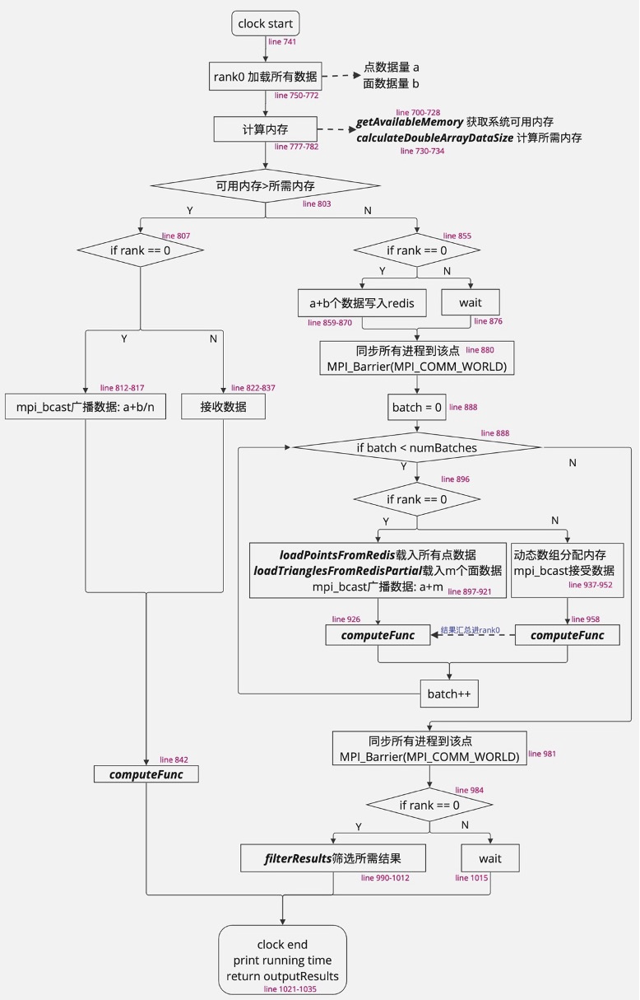

# 1.问题描述
城市尺度下的大量计算任务，通常可以被简化为简单的立体几何数学问题。这些计算任务往往具有高度的可并行性，但同时也面临着计算资源（特别是内存）不足的问题。在这种情况下，使用 MPI (Message Passing Interface) 结合 Redis 这种架构是一个合理的选择。

### MPI的优势
MPI允许在多个处理器上分布计算负载，对于城市规模的大数据集，这种并行处理变得尤为重要，这意味着可以同时处理多个计算任务，大幅提高处理速度。
		
### Redis的作用
1. 解决内存限制问题，当单个机器的内存不足以处理大规模数据时，Redis可以作为一个共享的内存资源，允许多个进程批次访问并加载数据。
2.	Redis作为一个高性能的内存数据库，可以快速读写数据，减少磁盘I/O的延迟。
3.	Redis支持数据的持久化，这意味着即使在计算过程中发生故障，数据也不会丢失。

以淮海路为例，在其上均匀设置50个观测点。从每个观测点出发，水平向四周发射36条线段，每两条线段之间的间隔为10度，每条线段的长度为200米。为了考虑高度因素，这些线段会沿Z轴方向每隔一米向上延伸（共循环5次），从而形成一个三维的观测网格。目标是计算这些线段与城市中所有建筑物表面（被抽象为三角面）的交点。在这个过程中只关注与每条线段最近的交点，以获取最直接的视线交汇信息。

# 2.主要代码文件
+ main.c
+ mpi_geometry_processing.c
+ mpi_geometry_processing.h 

### main.c

其中，
m的值可以根据计算机性能自行设定每次加载的数据量。

**ComputeFunc** 在 **main.c** 中被设置，并且提供了两个不同的函数 **checkLineIntersections** 和 **checkIntersectionsAngle** 作为测试，以验证结构的通用性。

mpiGeometryProcessing传回关于结果的指针，可以选择结果的存储形式，例如写入名为intersections.csv的文件
 
### mpi_geometry_processing.c


其中，公共函数（例如mpiGeometryProcessing,**checkLineIntersections**, **checkIntersectionsAngle**需要在**mpi_geometry_processing.h**中进行声明

# 3.输出结果示例

checkLineIntersections 
line 398-493     
parameter为观测点到交点到距离

checkIntersectionsAngle 
line 518-630
parameter为线面夹角

# 4.环境配置

Windows
+ MS-MPI
+ Redis

Mac
+ OpenMPI
+ Redis

# 5.编译运行

### Windows
1. 编译 mpi_geometry_processing.c
```sh
gcc -c mpi_geometry_processing.c -o mpi_geometry_processing.o -I "C:\Program Files (x86)\Microsoft MPI\sdk\Include" -I "C:\Program Files (x86)\hiredis\include\hiredis"
```
2. 编译 main.c
```sh
gcc -o my_program main.c mpi_geometry_processing.o -I "C:\Program Files (x86)\Microsoft MPI\sdk\Include" -I "C:\Program Files (x86)\hiredis\include\hiredis" -L "C:\Program Files (x86)\Microsoft MPI\sdk\Lib\x64" -L "C:\Program Files (x86)\hiredis\lib" -l hiredis -l msmpi -l msmpifec -l msmpifmc
```
3. 运行程序
```sh
"C:\Program Files (x86)\Microsoft MPI\Bin\mpiexec.exe" -np 2 .\my_program
（在此可设置开启的进程数）
```
### Mac
```sh
make run 
```
在Makefile里设置进程数

# 6.输入文件格式

文件命名与示例保持一致，数据格式与示例保持一致
+ point.csv
+ triangles.csv

或在 **mpi_geometry_processing.c** 中的 **mpiGeometryProcessing** 里对应位置更改读取文件的对应文件名。例如macOS系统对应代码文件里的753和758行。
